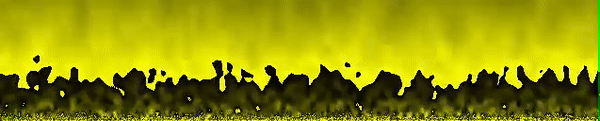
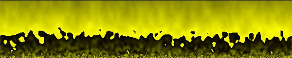
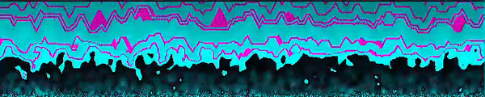

# SFML-FireEffect
Here I provide a C++ SFML implementation of the classic Fire Effect. First, I replicated the work presented by Lode Vandevenne at his website: https://lodev.org/cgtutor/fire.html. Thereafer, I provide an optimization over his approach. 

## Fire Effect
The "fire" lives within a N X M buffer where every location (i, j) is within [0, 255]. This buffer is used to index into a palette of colors later drawn onto the screen. Palette colors are generated using a hue, saturation, and lighteness (HSL) to RGB conversion as described at https://en.wikipedia.org/wiki/HSL_and_HSV. A more detailed explanation is provided by Vandvenne in his website.  

Replication of Vandevenne's work using SFML (fire.cpp). 

## Optimization
Unfortanutely, as also pointed out by Vandevenne, the version of the effect is not very fast; especially at high resolutions. Thus, I offer an improvement upon his design. First, instead of a 2D buffer, I use a 1D fire buffer. That way I can achieve the same memory accesses in ~O(N + M) time as opposed to O(N*M). This is also true when drawing the individual pixels onto the window. 

After improvement (fireOptimized.cpp). 

Even though values are randomly generated, notice that seemingly there is no difference between the previous two images. 

Showcasing of the animation in blue. 

